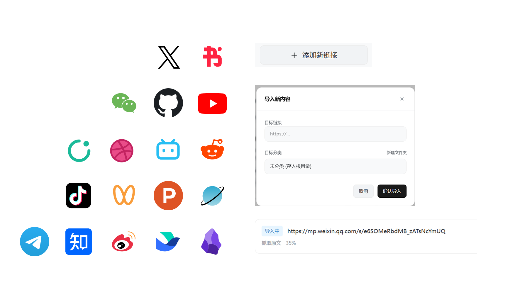
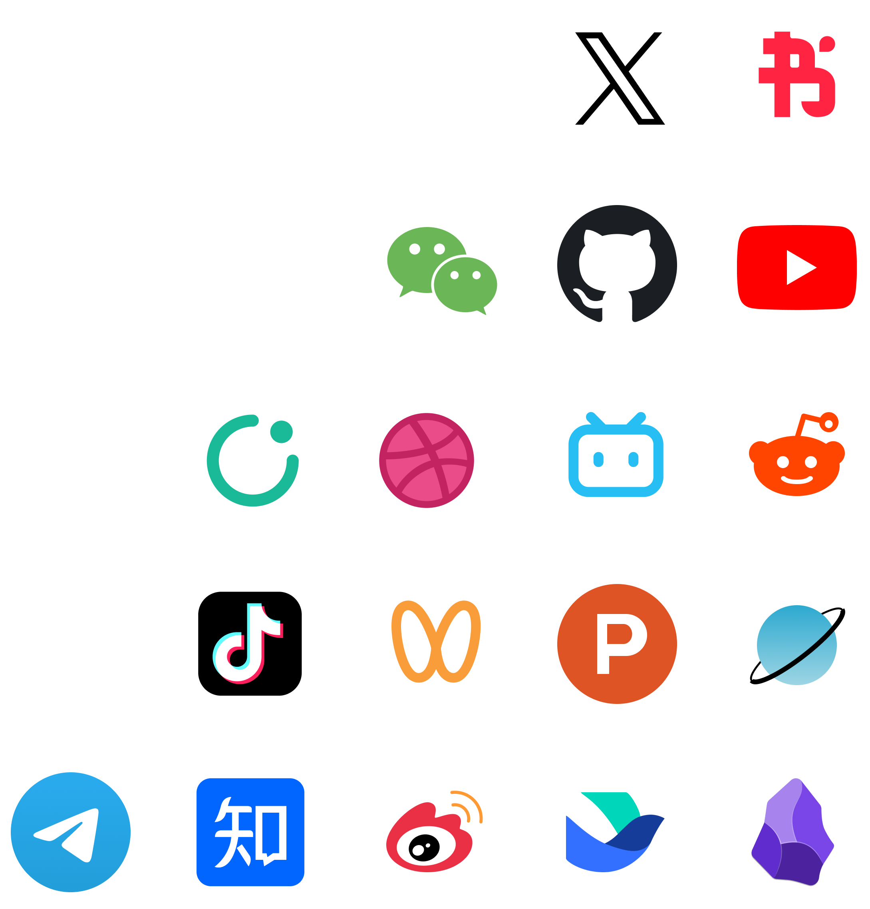
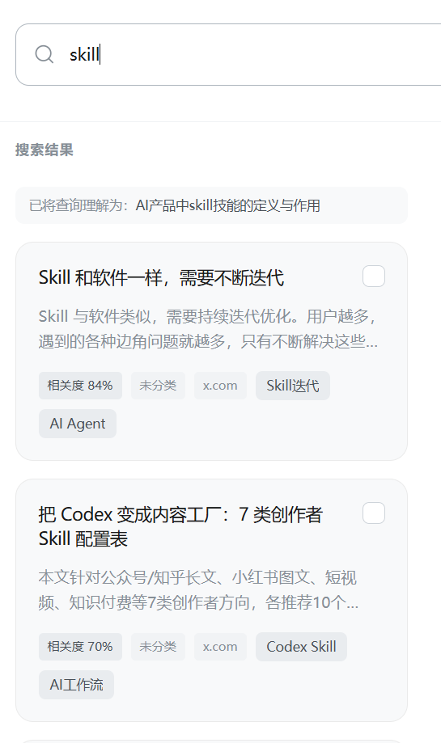
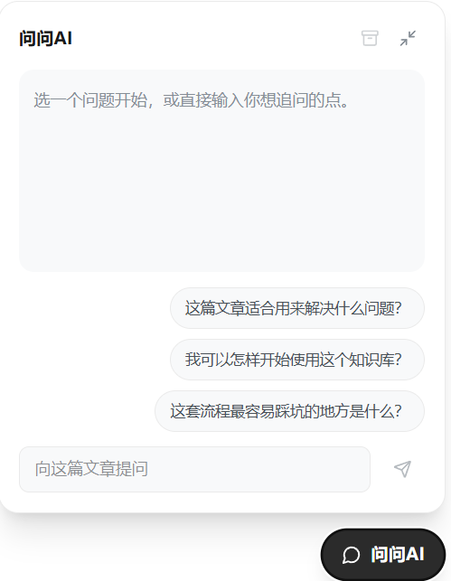
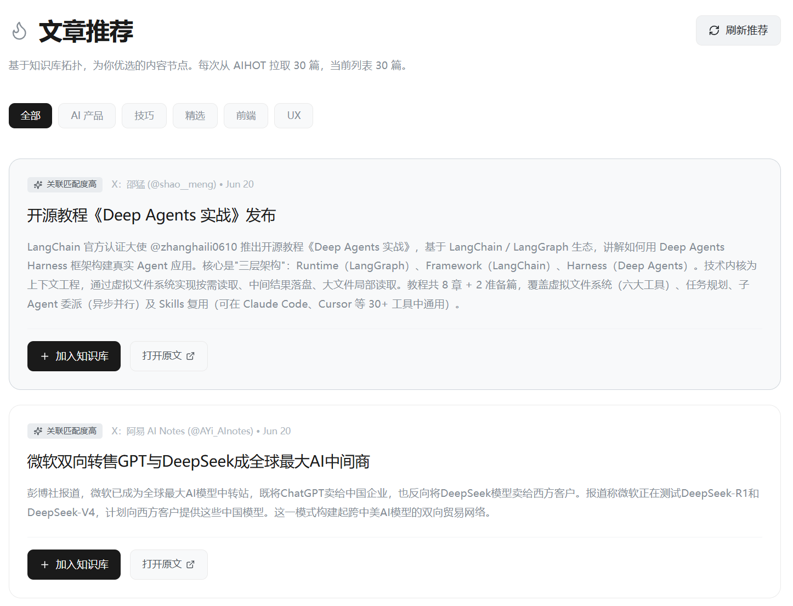

# 别吃灰 · 介绍页文案

日期：2026-06-20

介绍页的首要目标：

- 先让用户产生“这个值得下载试试”的感觉
- 再用下半段说明它为什么不是普通收藏夹

***

## 一、Hero

**主标题：**
`别让收藏继续吃灰`

**副标题：**
`支持 17+ 平台内容导入，把文章、热点和社媒内容整理成可搜索、可追问、可回看的本地知识库。`

**补充说明：**
`先下载，再慢慢把收藏变成真正能复用的个人知识资产。`

**主按钮：**
`立即使用（下拉后选择win或者mac）`

**次按钮 ：**
`了解一下`

**右侧下载卡片标题：**
`下载使用`

**右侧下载卡片说明：**
`把下载放在第一页最醒目的位置。Windows 入口已接真实包体路径；macOS 入口先预留正式按钮位，等安装包产出后替换。`

**Hero 主图 ：**

D:\Users\HCI\_lab\Desktop\github\biechihui-web\docs\product-intro-assets\home.png

参考这个截图来绘制界面，信息无害化处理，文字稍大一些，层级低不重要的信息用色块处理；外侧加一个mac界面的容器，容器内是界面截图。四周边缘放一些气泡，“问问AI”，“生成日报”，“文章推荐”

***

## 二、信任条

***

## 三、四个产品亮点

### 01 支持17+主流平台

**标题：**
`不是只存网页，而是把不同来源的内容收进同一个知识库`

**正文：**
`别吃灰支持 17+ 平台内容导入，通过复制链接快速的把文章导入知识库。`

**图片 ：**
整体效果如图：

左侧的logo组采用，右侧的界面卡片根据截图绘制

### 02 强大的检索能力

**标题：**
`只记得一个观点，也能把文章重新找回来`

**正文：**
`支持自然语言搜索、查询改写和基于结果继续提问。它不是普通收藏夹里的标题查找，而是围绕你已经保存过的内容做语义检索和复用。`

**图片：**
参考这个截图来绘制界面，信息无害化处理；

### 03 知识内化多入口

**标题：**
`知识内化多入口`

**正文：**
`你可以在知识库详情页围绕单篇文章继续追问，也可以在搜索页勾选多篇文章联合问答，还可以在日历页通过日报回顾一天的输入，把“看过”逐步变成“消化过”。`

**图片 brief：**
聊天框连接知识卡片节点，参考这个截图来绘制界面，信息无害化处理；

### 04 文章推荐

**标题：**
`基于 AIHOT 多平台热点追踪，看到有价值的文章就收进来`

**正文：**
`除了整理自己的收藏，你也可以从 AIHOT 的多平台热点追踪里发现值得读的新文章。看到有价值的内容后，可以直接一键导入知识库，继续进入摘要、标签、检索和回看流程。`

**图片 ：**
参考这个截图来绘制界面，信息无害化处理；

## 四、底部下载区

**标题：**
`直接下载，开始整理你的第一篇文章`

**说明：**
`这一块保持强转化，不再展开解释太多功能。用户如果已经被前面的亮点打动，这里就应该直接给出明确的下载动作。`

***

## 五、底部 CTA

**主标题：**
`支持 17+ 平台导入，把收藏变成真正能复用的知识库`

**按钮：**
`立即使用`

***

## 页脚

`别吃灰 · 本地个人知识库`
