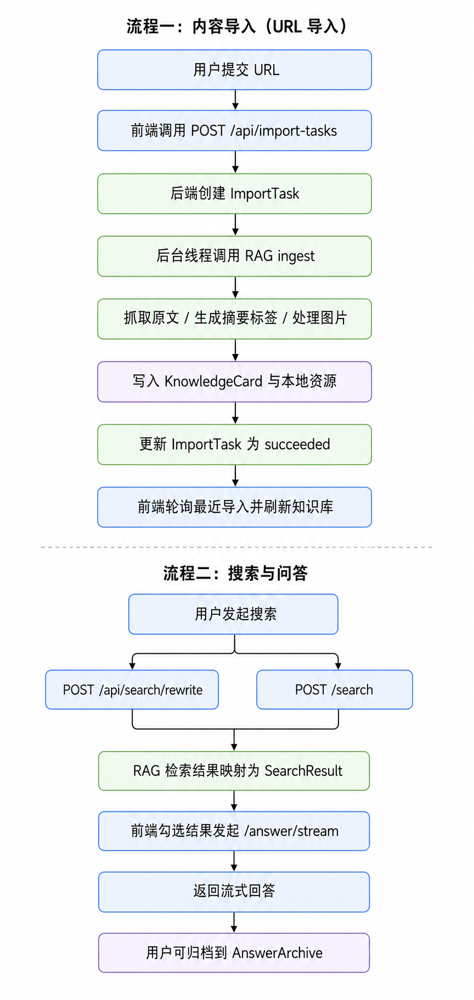
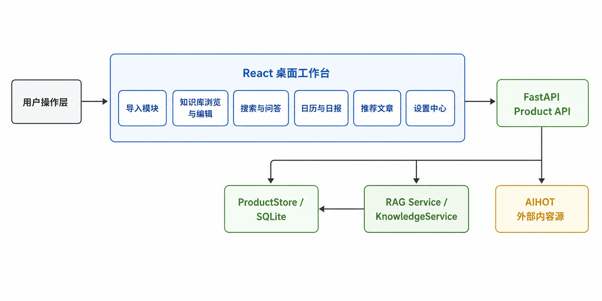
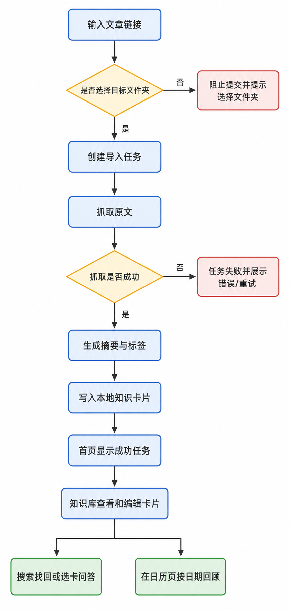

# 别吃灰产品需求文档（PRD）

日期：2026-06-20

适用范围：当前仓库对应的桌面端最小可用版本（React + FastAPI + Tauri）

说明：本文基于当前代码仓库、已有页面、接口与交互实现整理，目标是沉淀一份贴近现状、可供产品/设计/研发/测试共用的标准 PRD。文中会明确区分“已实现能力”和“规划/占位能力”，避免将未落地内容误判为已交付。

## 1. 产品概述

### 1.1 产品名称与定位

- 产品名称：别吃灰
- 产品定位：一款面向个人用户的本地优先知识库桌面应用，帮助用户把分散收藏的网页文章转化为可整理、可检索、可回看的长期知识资产。
- 产品应用语言：默认简体中文界面；当前仓库未体现多语言切换能力。

### 1.2 产品愿景与目标

- 产品愿景：让用户用尽可能低的整理成本，把“收藏过但找不到、存下来却没再看”的内容沉淀为真正可复用的个人知识库。
- 当前阶段目标：
  - 打通“导入链接 -> 生成卡片 -> 整理归档 -> 搜索找回 -> 问答复用 -> 时间回顾”的最小闭环。
  - 提供本地优先的桌面使用体验，降低对复杂部署和多端系统的依赖。
  - 将 AI 能力聚焦在摘要、标签、检索改写、问答和日报生成，而不是做泛化聊天工具。
  - 保持单用户、单机、轻量工作流，优先优化稳定性和可理解性。

### 1.3 产品使用终端

- 终端类型：Windows 桌面应用为当前主交付形态。
- 技术形态：React Web UI 运行在 Tauri 桌面壳内，通过本地 FastAPI 服务提供真实数据和 RAG 能力。
- 开发期支持：浏览器开发环境可直连本地后端调试。

### 1.4 核心价值主张

- 本地优先：知识卡片、文件夹、导入记录、运行配置优先存放在本地，不强依赖云账号体系。
- 低门槛采集：用户只需输入文章链接，即可进入统一导入链路。
- AI 自动结构化：系统自动抽取正文、生成摘要、标签、建议问题、检索与日报内容。
- 可回看、可复用：支持知识库浏览、模糊搜索、搜索页多卡问答、知识库内单卡追问、日报回顾与问答归档。
- 平台抓取增强：支持在设置页维护 feedgrab 登录态，为需要登录会话的 X、小红书、微信内容抓取做准备。

### 1.5 目标用户群体分析

- 人群 A：长期收藏文章的知识工作者
  - 特征：常浏览公众号、博客、产品分析、技术文章，有持续收藏习惯。
  - 痛点：资料分散在浏览器、聊天和笔记工具里，回头很难找；收藏数量大但复用率低。
  - 需求：希望快速保存、后续能按语义找回，并能用 AI 帮助总结和再理解。
- 人群 B：研究型学习者与独立创作者
  - 特征：会围绕一个主题持续收集材料，需要沉淀观点与素材。
  - 痛点：内容有保存但没有结构；很难按时间线回顾当天读了什么。
  - 需求：需要摘要、标签、备注、日报和可引用问答，辅助形成自己的知识脉络。
- 人群 C：对本地 AI 工作流感兴趣的个人用户
  - 特征：接受本地应用和 API Key 配置，关注数据掌控感。
  - 痛点：云笔记太重、纯聊天工具不沉淀、通用收藏工具不够智能。
  - 需求：希望拥有轻量、安静、可长期使用的个人知识库工具。

### 1.6 市场需求与竞品简析

- 市场需求：
  - 用户普遍存在“存而不看、看完即忘、想找找不到”的资料管理问题。
  - AI 检索和问答正在成为内容复用的新入口，但很多产品仍缺少稳定的个人知识沉淀容器。
  - 个人用户对“轻量、本地可控、非团队协作型”的知识工具存在稳定需求。
- 竞品简析：
  - 通用收藏工具：采集方便，但结构化和复用能力弱。
  - 笔记工具：编辑强，但导入网页、自动摘要、语义检索通常不是默认强项。
  - AI Chat 工具：问答强，但知识留存、归档和长期管理弱。
  - RAG 工具/本地知识库工具：检索能力强，但产品化体验、导入流程和日常回顾体验常较粗糙。
- 本产品优势：
  - 不是泛知识平台，而是围绕“个人网页资料沉淀”做窄而深的闭环。
  - 以知识卡片为核心，兼顾采集、整理、检索、问答与回顾。
  - 本地优先 + 桌面壳形态，更贴近“个人长期使用工具”而非在线协作产品。

### 1.7 技术架构概览

- 前端：React 19 + TypeScript + Vite + React Router + TanStack Query + Zustand
- 桌面壳：Tauri 2
- 后端：FastAPI
- 数据层：本地 SQLite 快照/表结构，由 `backend/app/db.py` 和 `backend/app/store.py` 管理
- AI / RAG：
  - 导入、搜索、问答、日报依赖本地 `KnowledgeService`
  - 默认模型配置优先走 SiliconFlow
  - 支持 Chat / Embedding / Rerank 独立配置
  - 支持 feedgrab 登录态检测与浏览器登录拉起，用于增强受平台会话保护内容的抓取
- 核心服务边界：
  - 前端负责工作台 UI、状态、筛选与交互
  - FastAPI 提供页面数据接口、导入任务、设置接口、热点推荐接口
  - RAG Service 负责正文抓取、摘要、标签、建议问题、搜索改写、问答和日报生成

---

## 2. 功能规格

### 2.1 功能详述

| 功能ID | 模块 | 功能名称 | 功能描述 | 优先级 |
| --- | --- | --- | --- | --- |
| BH-P0-001 | 导入 | 单链接导入 | 用户通过侧边栏“添加新链接”或推荐页导入入口提交单个 URL，并指定目标文件夹。 | P0 |
| BH-P0-002 | 导入 | 导入任务跟踪 | 创建导入任务后，系统记录任务状态、阶段、进度、错误信息，并在首页展示最近导入记录。 | P0 |
| BH-P0-003 | 导入 | 导入失败重试 | 导入失败任务支持在首页直接重试，复用原任务参数。 | P0 |
| BH-P1-004 | 导入 | 重复链接重建导入 | 当用户重新导入已存在来源链接，系统可识别重复来源并按重建逻辑更新底层卡片，避免旧内容残留。 | P1 |
| BH-P0-005 | 文件夹 | 文件夹浏览 | 用户可在知识库导航中查看文件夹列表，并进入单个文件夹查看卡片。 | P0 |
| BH-P0-006 | 文件夹 | 新建文件夹 | 用户可在侧边栏新建单层文件夹，新建后自动跳转至该文件夹。 | P0 |
| BH-P0-007 | 文件夹 | 重命名文件夹 | 用户可对非系统文件夹执行重命名。 | P0 |
| BH-P0-008 | 文件夹 | 删除文件夹 | 删除非系统文件夹时，文件夹内卡片迁移到“未分类”，文件夹本身删除。 | P0 |
| BH-P0-009 | 首页 | 数据总览 | 首页展示总计文章、总计字数、文件夹数、本周导入数。 | P0 |
| BH-P0-010 | 首页 | 活跃度热力图 | 首页按日期展示知识活跃度，点击日期跳转至日历页对应日期。 | P0 |
| BH-P0-011 | 首页 | 推荐摘要入口 | 首页展示推荐文章摘要卡片，并提供前往推荐页入口。 | P1 |
| BH-P0-012 | 知识库 | 全部收藏浏览 | 用户可在知识库中浏览所有非删除卡片。 | P0 |
| BH-P0-013 | 知识库 | 多维筛选与排序 | 支持按标签、来源筛选，并按最近修改、创建时间、标题、来源排序。 | P0 |
| BH-P0-014 | 知识库 | 切换展示视图 | 支持卡片视图与紧凑列表视图切换。 | P1 |
| BH-P0-015 | 知识库 | 卡片详情查看 | 选中卡片后在右侧详情栏展示来源、文件夹、时间、标签、摘要、备注、图片、问答归档与原文。 | P0 |
| BH-P0-016 | 知识库 | 原文 Markdown 渲染 | 原文区支持基础 Markdown、代码块、图片与链接渲染，并剥离 feedgrab 抓取过程中的 front matter 元数据。 | P1 |
| BH-P0-017 | 知识库 | 卡片编辑 | 用户可编辑标题、摘要、备注、标签，保存后写回卡片。 | P0 |
| BH-P0-018 | 知识库 | 卡片移动文件夹 | 用户可在详情页切换卡片所属文件夹。 | P0 |
| BH-P0-019 | 知识库 | 内容质量标记 | 用户可对卡片标记“重要”或“坏数据”。 | P1 |
| BH-P0-020 | 知识库 | 重新抓取 | 用户可触发重新抓取原文，系统通过导入任务队列异步更新该卡片。 | P1 |
| BH-P0-021 | 知识库 | 重新生成摘要与标签 | 用户可基于原链接重新生成卡片内容，保留备注等部分人工内容。 | P1 |
| BH-P1-022 | 知识库 | 单卡问问AI | 用户可在知识卡详情页直接围绕当前卡片发起多轮问答，并查看流式回复。 | P1 |
| BH-P1-023 | 知识库 | 建议问题 | 系统可为卡片展示最多 3 条建议问题，帮助用户快速开始追问。 | P1 |
| BH-P1-024 | 知识库 | 对话归档 | 用户可将知识库内的单卡问答完整对话归档到当前文章卡片下。 | P1 |
| BH-P0-025 | 回收站 | 软删除 | 删除卡片后进入回收站，默认从知识库、搜索、日历等主流程中隐藏。 | P0 |
| BH-P0-026 | 回收站 | 恢复卡片 | 用户可将回收站卡片恢复到原文件夹；原文件夹不存在时恢复到未分类。 | P0 |
| BH-P0-027 | 回收站 | 永久删除 | 用户可在回收站永久删除卡片，操作需二次确认。 | P0 |
| BH-P0-028 | 日历 | 日期回顾 | 用户可按日期查看当天导入的卡片列表、篇数和字数。 | P0 |
| BH-P0-029 | 日历 | 日报生成 | 用户可针对某天知识内容生成 AI 日报，包括总结、主题、关键词和值得回看内容。 | P1 |
| BH-P0-030 | 搜索 | 查询改写 | 用户输入自然语言检索词后，系统可调用改写接口生成更适合检索的查询。 | P1 |
| BH-P0-031 | 搜索 | 语义检索 | 用户可检索知识卡片，结果展示相关度、文件夹、来源和标签。 | P0 |
| BH-P0-032 | 搜索 | 选卡问答 | 用户可勾选搜索结果中的知识卡片并针对这些卡片提问，系统流式返回答案。 | P0 |
| BH-P0-033 | 搜索 | 问答归档 | 用户可将回答归档到某篇文章卡片下，供后续回看。 | P1 |
| BH-P0-034 | 推荐 | 热点文章拉取 | 系统可从 AIHOT 拉取推荐文章列表并本地缓存状态。 | P1 |
| BH-P0-035 | 推荐 | 推荐分类浏览 | 用户可按全部、AI 产品、技巧、精选、前端、UX 分类浏览推荐内容。 | P1 |
| BH-P0-036 | 推荐 | 单篇导入 | 用户可从推荐页选择单篇文章并导入到指定文件夹。 | P1 |
| BH-P0-037 | 设置 | 模型配置 | 用户可配置 SiliconFlow、Chat、Embedding、Rerank 相关参数，并保存到后端运行配置。 | P0 |
| BH-P1-038 | 设置 | 数据源状态展示 | 设置页展示前端 API 地址、当前数据源模式和运行配置文件路径。 | P1 |
| BH-P1-039 | 设置 | feedgrab 登录态管理 | 用户可在设置页查看 X、小红书、微信的 feedgrab 登录态，并触发浏览器登录流程。 | P1 |
| BH-P2-040 | 设置 | 备份/导出入口 | 设置页已提供“创建备份”“导出数据”按钮，但当前仅为占位反馈，未打通真实任务。 | P2 |

### 2.2 功能模块间的关系图

---

## 3. 用户流程

### 3.1 用户旅程地图

| 阶段 | 用户行为 | 心理感受 | 触点/功能点 | 痛点 | 解决方案/机会点 |
| --- | --- | --- | --- | --- | --- |
| 发现资料 | 用户在外部看到值得保存的网页文章 | 想留下，但担心之后又找不到 | 导入弹窗、推荐页导入 | 收藏后常常不再看 | 用单链接导入降低采集门槛 |
| 导入处理 | 用户选择文件夹并发起导入 | 期待系统自动处理 | 导入任务、首页最近导入 | 导入耗时、失败原因不透明 | 展示任务状态、阶段、失败信息与重试 |
| 初步整理 | 用户在知识库查看新卡片并修正内容 | 希望快速建立秩序 | 文件夹、标签、备注、详情编辑 | AI 摘要可能不准；资料容易混乱 | 提供人工编辑、移动文件夹、重要/坏数据标记 |
| 回找资料 | 用户只记得模糊概念或主题 | 想快点找回之前看过的内容 | 搜索页、查询改写 | 记不住标题、来源 | 支持自然语言检索和相关度排序 |
| 深度复用 | 用户围绕选中的内容继续提问 | 期待答案可信、可追溯 | 选卡问答、问答归档 | 泛化聊天缺少上下文，回答不沉淀 | 基于卡片内容问答，并归档回文章 |
| 周期回顾 | 用户想回看某一天读了什么 | 希望内容有总结，不只是列表 | 日历页、日报生成 | 收藏行为缺少复盘机制 | 按日期聚合并生成日报，强化回顾感 |
| 平台抓取准备 | 用户想导入需要登录态的平台内容 | 希望少折腾配置和命令行 | 设置页 feedgrab 登录态 | 平台内容抓取常受登录限制 | 在设置页集中查看登录状态并一键拉起登录 |

### 3.2 关键路径流程图

### 3.3 各场景下的用户操作步骤

#### 场景 A：导入一篇普通网页文章

1. 用户点击侧边栏“添加新链接”。
2. 在导入弹窗中粘贴 URL。
3. 选择目标文件夹；如果没有合适文件夹，可先创建文件夹。
4. 点击提交，系统创建导入任务。
5. 用户关闭弹窗后，可在首页“最新导入记录”查看处理状态。
6. 导入成功后，用户进入知识库查看新卡片。

#### 场景 B：在知识库中整理导入后的卡片

1. 用户进入知识库或指定文件夹。
2. 在列表中选择某张卡片，打开详情栏。
3. 用户检查标题、摘要、标签和原文。
4. 若 AI 内容不理想，用户编辑标题、摘要、备注、标签并保存。
5. 如需归类，用户切换所属文件夹。
6. 如卡片质量有问题，可标记为“坏数据”或移入回收站。

#### 场景 C：通过模糊记忆找回资料并继续问答

1. 用户进入搜索页，输入自然语言关键词。
2. 系统执行查询改写与搜索，返回相关卡片。
3. 用户勾选一张或多张结果卡片。
4. 用户在右侧输入问题，系统流式返回回答。
5. 如果回答有价值，用户点击“归档到文章”。

#### 场景 D：回顾某天读过的内容

1. 用户在首页点击热力图某一天，或直接进入日历页。
2. 在左侧日期列表选择日期。
3. 右侧查看当日卡片、篇数和字数。
4. 用户点击“生成日报摘要”。
5. 系统输出总结、主题、关键词和值得回看的卡片入口。

#### 场景 E：为受平台会话保护的内容做抓取准备

1. 用户进入设置页。
2. 在“feedgrab 平台登录态”区域查看 X、小红书、微信的当前状态。
3. 用户点击对应平台的登录按钮。
4. 系统拉起浏览器登录流程。
5. 登录完成后，用户刷新状态，后续导入流程可复用本机保存的会话。

---

## 4. 数据流设计

### 4.1 数据结构与关系（概念模型）

- Folder
  - 核心字段：`id`、`name`、`isSystem`、`sortOrder`、`createdAt`、`updatedAt`、`cardCount`
  - 关系：一个文件夹可包含多张知识卡片；第一版为单层结构。
- KnowledgeCard
  - 核心字段：`id`、`title`、`userTitle`、`url`、`siteName`、`folderId`、`summary`、`userSummary`、`contentPreview`、`fullContent`、`note/notes`、`tags`、`wordCount`、`createdAt`、`updatedAt`、`isImportant`、`isBadData`、`isDeleted`
  - 关系：属于一个文件夹，可有多个标签、多个图片资源、多个问答归档。
- ImportTask
  - 核心字段：`id`、`url`、`folderId`、`status`、`stage`、`progress`、`errorCode`、`errorMessage`、`retryCount`、`resultCardId`
  - 关系：一次导入任务成功后会生成或刷新一张知识卡片。
- AnswerArchive
  - 核心字段：`id`、`cardId`、`question`、`answer`、`usedCardIds`、`model`、`createdAt`
  - 关系：归属于一张目标卡片，用于保存问答结果。
- FeedgrabLoginStatus
  - 核心字段：`sessionDir`、`platforms.x`、`platforms.xhs`、`platforms.wechat`
  - 子字段：`loggedIn`、`state`、`message`、`sessionPath`、`updatedAt`、`ageHours`、`missingCookies`
  - 关系：属于设置中心的运行状态数据，用于展示平台登录态，不直接写入知识卡片。
- DailyReport
  - 核心字段：`date`、`summary`、`topics`、`keywords`、`highlightCardIds`、`createdAt`
  - 关系：按日期聚合卡片内容生成日报。
- HotArticle
  - 核心字段：`id`、`title`、`source`、`publishedAt`、`summary`、`url`、`category`、`status`
  - 关系：可通过导入任务转化为知识卡片。

### 4.2 关键数据流向图

### 4.3 数据存储与处理原则

- 数据安全：
  - 模型配置通过设置页写入本地运行配置文件，不在前端明文持久化展示旧值。
  - 前后端通过本地 HTTP 通信，开发和桌面运行端口固定。
- 数据隐私：
  - 产品定位为本地优先，知识卡片、文件夹、导入任务、日报等核心数据默认保存在本地。
  - AI 能力仍依赖用户提供的模型 API，非完全离线产品。
  - feedgrab 登录态会话保存在本机 session 目录，用于后续平台抓取复用。
- 一致性与可用性：
  - 卡片删除采用软删除优先，再进入永久删除。
  - 导入失败、模型不可用、后端不可达时，需要明确给出错误提示，不静默失败。
  - 导入任务与热点文章导入状态需要在 UI 中持续可见。
  - 对重复来源链接的重新导入，需要通过重建策略避免旧内容和新内容并存。
- 可扩展性：
  - 当前已保留 `sourceType`、`parentId`、`refreshStatus`、`archivedAt`、`suggestedQuestions` 等字段，为后续多来源导入、分层目录、刷新链路和卡片内智能追问留出空间。
  - 搜索与问答目前以卡片为主，后续可逐步扩展到 chunk 级引用。

---

## 5. 页面规格

### 5.1 页面概览

| 页面ID | 页面名称 | 核心功能 |
| --- | --- | --- |
| PAGE-001 | 首页 | 数据总览、活跃度热力图、最近导入记录、推荐摘要入口 |
| PAGE-002 | 知识库 | 全部收藏/文件夹浏览、筛选排序、卡片列表与详情 |
| PAGE-003 | 回收站 | 已删除卡片查看、恢复、永久删除 |
| PAGE-004 | 日历 | 按日期查看知识归档、生成日报 |
| PAGE-005 | 搜索 | 语义检索、选卡问答、问答归档 |
| PAGE-006 | 文章推荐 | 热点推荐浏览、分类筛选、单篇导入 |
| PAGE-007 | 设置 | 模型配置、数据源状态展示、备份/导出入口 |
| PAGE-008 | 导入弹窗 | URL 输入、文件夹选择、导入提交 |
| PAGE-009 | 侧边栏导航 | 主导航、文件夹管理、导入入口、设置入口 |

### 5.2 页面详情

#### PAGE-001 首页

- 页面名称与目的：承载知识库的总体状态展示和近期动态，让用户快速判断系统是否正常工作、最近导入了什么。
- 页面负责的核心功能：
  - 展示总计文章、总计字数、文件夹数、本周导入数
  - 展示知识活跃度热力图
  - 展示最近导入任务
  - 展示推荐文章摘要入口
- 主要 UI 元素与布局建议：
  - 顶部标题区
  - 4 个统计卡片
  - 中部热力图区
  - 最近导入列表区
  - 推荐摘要双列区
- 页面需展示的关键数据：
  - `DashboardStats`
  - `DailyActivity[]`
  - `ImportTask[]`
  - `HotArticle[]` 摘要数据

#### PAGE-002 知识库

- 页面名称与目的：作为核心工作台，承担知识卡片浏览、筛选、查看与编辑任务。
- 页面负责的核心功能：
  - 浏览全部收藏或指定文件夹
  - 按标签、来源筛选
  - 按时间/标题/来源排序
  - 卡片视图与紧凑列表切换
  - 查看和编辑卡片详情
  - 在详情页直接问问 AI
  - 使用建议问题快速发起追问
  - 归档单卡问答对话
  - 移动文件夹、标记状态、重新抓取、重新生成
- 主要 UI 元素与布局建议：
  - 左侧主导航
  - 中间列表区
  - 右侧详情区
  - 未选中卡片时保持双栏，选中后进入三栏
  - 详情页右下角悬浮“问问AI”入口
  - 展开式问答归档区
- 页面需展示的关键数据：
  - `Folder[]`
  - `KnowledgeCard[]`
  - 当前选中卡片的全部字段
  - `suggestedQuestions`
  - `answerArchives`

#### PAGE-003 回收站

- 页面名称与目的：承接软删除后的内容管理，避免误删带来不可逆损失。
- 页面负责的核心功能：
  - 浏览已删除卡片
  - 恢复卡片
  - 永久删除卡片
- 主要 UI 元素与布局建议：
  - 页面标题区
  - 删除卡片列表
  - 每张卡片右侧提供恢复和永久删除操作
  - 永久删除前弹出确认对话框
- 页面需展示的关键数据：
  - `KnowledgeCard.isDeleted`
  - `deletedAt`
  - 标题、摘要预览

#### PAGE-004 日历

- 页面名称与目的：帮助用户从时间维度回顾每天的知识积累，并生成日报。
- 页面负责的核心功能：
  - 日期列表浏览
  - 当日卡片列表展示
  - 当日篇数和字数统计
  - 生成日报摘要
  - 点击高亮卡片跳回知识库
- 主要 UI 元素与布局建议：
  - 左侧日期时间线
  - 右侧当日详情区
  - 顶部日期和统计信息
  - 日报卡片区
  - 当日归档列表区
- 页面需展示的关键数据：
  - 当日 `KnowledgeCard[]`
  - `DailyReport`
  - `wordCount` 聚合值

#### PAGE-005 搜索

- 页面名称与目的：解决“记得看过，但找不到”的问题，并在找回后继续问答。
- 页面负责的核心功能：
  - 输入自然语言查询
  - 展示改写后的查询
  - 展示检索结果与相关度
  - 勾选结果进行问答
  - 流式展示回答
  - 归档回答到文章
- 主要 UI 元素与布局建议：
  - 顶部搜索输入框
  - 左侧搜索结果列表
  - 右侧问答面板
  - 回答完成后显示归档按钮与模型信息
- 页面需展示的关键数据：
  - `SearchResult[]`
  - 勾选状态
  - 流式回答内容
  - `AnswerArchive` 归档状态

#### PAGE-006 文章推荐

- 页面名称与目的：提供与用户知识兴趣相关的外部热点文章入口，帮助用户扩充知识库。
- 页面负责的核心功能：
  - 拉取推荐文章
  - 分类切换
  - 查看来源、时间、摘要
  - 单篇导入到知识库
  - 显示导入状态
- 主要 UI 元素与布局建议：
  - 顶部标题和刷新按钮
  - 分类标签栏
  - 推荐文章卡片流
  - 卡片底部提供“加入知识库”和“打开原文”
- 页面需展示的关键数据：
  - `HotArticle[]`
  - `status`
  - `category`

#### PAGE-007 设置

- 页面名称与目的：提供模型服务配置和系统状态信息，是当前产品启动后必须访问的重要页面。
- 页面负责的核心功能：
  - 查看模型配置状态
  - 编辑并保存 SiliconFlow、Chat、Embedding、Rerank 参数
  - 查看当前数据源模式、API 地址和后端配置路径
  - 查看并刷新 feedgrab 登录态
  - 触发 X / 小红书 / 微信登录
  - 展示备份/导出入口
- 主要 UI 元素与布局建议：
  - 状态摘要卡片
  - 模型服务表单区
  - feedgrab 登录态卡片区
  - 备份/导出两个能力卡片
- 页面需展示的关键数据：
  - `RuntimeConfigStatus`
  - `FeedgrabLoginStatusResponse`
  - 表单字段值
  - `apiBaseUrl`
  - 当前数据源模式

#### PAGE-008 导入弹窗

- 页面名称与目的：统一承接文章导入动作，是主流程的关键起点。
- 页面负责的核心功能：
  - 输入 URL
  - 选择文件夹
  - 提交导入
  - 在推荐页场景下复用相同组件
- 主要 UI 元素与布局建议：
  - 弹窗标题
  - URL 输入框
  - 文件夹选择器
  - 提交/取消按钮
- 页面需展示的关键数据：
  - URL
  - `Folder[]`

#### PAGE-009 侧边栏导航

- 页面名称与目的：提供全局导航与文件夹管理入口。
- 页面负责的核心功能：
  - 主导航切换
  - 知识库目录展开/收起
  - 文件夹新建、重命名、删除
  - 打开导入弹窗
  - 进入设置页
- 主要 UI 元素与布局建议：
  - Logo 区
  - 主导航区
  - 文件夹树区
  - 底部导入按钮
  - 底部设置按钮
- 页面需展示的关键数据：
  - `Folder[]`
  - 当前路由状态

---

## 6. 当前范围边界与非目标

- 当前明确已落地：
  - 桌面端主流程页面、基础 CRUD、导入任务、搜索问答、知识库内单卡追问、推荐文章、设置页模型配置与 feedgrab 登录态管理
- 当前为占位/未完全打通：
  - 备份与导出只有按钮反馈，未形成真实任务链路
  - 多卡问答的后端当前主要按首张卡片回答，前端已预留多选能力
  - 推荐页“基于知识库拓扑”仍以外部文章拉取为主，个性化关联度表达偏产品文案层
  - feedgrab 登录态已经可管理，但尚未提供站内“内容源浏览器”或批量采集工作台
- 当前不在范围内：
  - 登录、多用户、云同步
  - 浏览器插件采集
  - 批量导入
  - PDF / Markdown / 本地文件导入
  - 多层级文件夹
  - 完整离线模型能力

## 7. 验收标准

- 用户可以在桌面应用中配置最小必要模型参数后，完成单链接导入。
- 首页可以稳定展示统计、热力图、最近导入记录和推荐摘要。
- 用户可以在知识库中浏览、筛选、编辑卡片，并进行文件夹管理。
- 用户可以在知识库详情页围绕当前文章继续问问 AI，并将完整对话归档回卡片。
- 用户可以把卡片移入回收站、恢复或永久删除。
- 用户可以在日历页查看某天卡片并生成日报。
- 用户可以通过自然语言检索知识卡片，并基于结果进行问答。
- 用户可以将回答归档到文章卡片下。
- 用户可以从推荐页将单篇文章导入到知识库。
- 设置页可以保存并重载模型运行配置。
- 用户可以在设置页查看并触发 X、小红书、微信的 feedgrab 登录流程。
